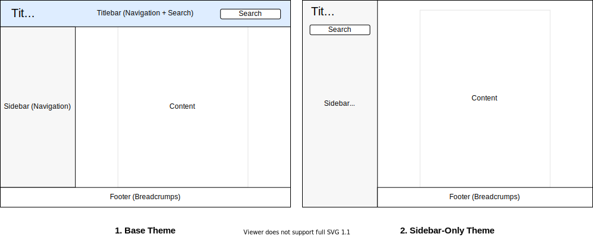

#  Doxygen Awesome

[](https://github.com/jothepro/doxygen-awesome-css/releases/latest)
[](https://github.com/jothepro/doxygen-awesome-css/blob/main/LICENSE)

<div style="filter: drop-shadow(0px 3px 15px rgba(0,0,0,0.25))">

[](https://jothepro.github.io/doxygen-awesome-css/)

</div>
<br>

**Doxygen Awesome** is a custom **CSS theme for doxygen** html-documentation with lots of customization parameters.

## Motivation

I really like how the doxygen html-documentation is structured! But IMHO it looks a bit outdated.

This theme is an attemt to update the visuals of doxygen without changing it's overall layout too much.

## Features

- 🌈 Clean, modern design
- 🚀 Heavily customizable by adjusting CSS-variables
- 🧩 No changes to the HTML structure of Doxygen required
- 📱 Improved mobile usability
- 🌘 Dark mode support!
- 🥇 Works best with **doxygen 1.9.1** or **1.9.2**
 
## Installation

Copy the `css` files from this repository into your project or add this repository as submodule and check out the latest release:

```bash
git submodule add https://github.com/jothepro/doxygen-awesome-css.git
cd doxygen-awesome-css
git checkout v1.5.0
```

Then make the option `HTML_EXTRA_STYLESHEET` in your Doxyfile point to the `css` files:

```
# Doxyfile
# ...
HTML_EXTRA_STYLESHEET  = doxygen-awesome-css/doxygen-awesome.css
```

### Variants

There is two variants of the theme.



1. **Base theme**:
```
# Doxyfile
GENERATE_TREEVIEW      = YES # optional. Also works without treeview
HTML_EXTRA_STYLESHEET  = doxygen-awesome-css/doxygen-awesome.css
```

2. **Sidebar-only theme** (experimental):
```
# Doxyfile
GENERATE_TREEVIEW      = YES # required!
HTML_EXTRA_STYLESHEET  = doxygen-awesome-css/doxygen-awesome.css doxygen-awesome-css/doxygen-awesome-sidebar-only.css
```

### Dark Mode Toggle (Experimental)

The theme comes with an experimental feature that adds a button to enable and disable the dark theme variant manually.

It requires customizations in both the header & footer html template.

1. Create default header & footer templates:
   ```bash
   doxygen -w html header.html footer.html delete_me.css
   ```

2. Reference the required resources in your `Doxyfile`:
   ```
   # Include the required Javascript
   HTML_EXTRA_FILES       = doxygen-awesome-css/doxygen-awesome-darkmode-toggle.js

   # Add the additional CSS. This is ONLY required for the sidebar-only theme variant!
   HTML_EXTRA_STYLESHEET  = doxygen-awesome-css/doxygen-awesome.css \ 
                            doxygen-awesome-css/doxygen-awesome-sidebar-only.css \
                            doxygen-awesome-css/doxygen-awesome-sidebar-only-darkmode-toggle.css

   # set custom header & footer files generated in previous step
   HTML_HEADER            = header.html
   HTML_FOOTER            = footer.html
   ```

3. In `header.html`, include `doxygen-awesome-darkmode-toggle.js` at the end of the `<head>`:
   ```html
   <html> 
       <head>
           <!-- ... other metadata & script includes ... -->
           <script type="text/javascript" src="$relpath^doxygen-awesome-darkmode-toggle.js"></script>
       </head>
       <body>
   ```
4. In `footer.html`, initialize the `doxygen-awesome-dark-mode-toggle` element at the end of the `<body>`:
   ```html
           <!-- ... -->
           <script type="text/javascript">
               // script for doxygen 1.9.1
               $(function() {
                   $(document).ready(function(){
                      toggleButton = document.createElement('doxygen-awesome-dark-mode-toggle')
                      toggleButton.title = "Toggle Light/Dark Mode"
                      document.getElementById("MSearchBox").parentNode.appendChild(toggleButton)
                  })
               })
           </script>
       </body>
   </html>
   ```
   **Attention**: In Doxygen 1.9.2 the searchbox and it's siblings are deleted on every resize, which is why the toggle button has to be re-added every time:
   ```js
   $(function() {
     toggleButton = document.createElement('doxygen-awesome-dark-mode-toggle')
     toggleButton.title = "Toggle Light/Dark Mode"

     $(document).ready(function(){
       document.getElementById("MSearchBox").parentNode.appendChild(toggleButton)
     })
     $(window).resize(function(){
       document.getElementById("MSearchBox").parentNode.appendChild(toggleButton)
     })
   })
   ```

## Examples

- Sidebar-Only theme: [Documentation of this repository](https://jothepro.github.io/doxygen-awesome-css/)
- Base theme: [libsl3](https://a4z.github.io/libsl3/)


## Configuration

### CSS Variables

This theme is highly customizable because a lot of things are parameterized with CSS variables. The following
list of parameters is not complete! You can easily modify any variable with the developer tools of your browser to find
out what it does.

To customize the existing theme, add your own `custom.css` and overwrite the variables there:
```
HTML_EXTRA_STYLESHEET  = doxygen-awesome-theme/doxygen-awesome.css custom.css
```

```css
/* custom.css */
html {
    /* define light-mode variable overrides here */
}

@media (prefers-color-scheme: dark) {
    html:not(.light-mode) {
        /* define dark-mode variable overrides here if you DON'T use doxygen-awesome-darkmode-toggle.js */
    }
}

html.dark-mode {
    /* define dark-mode variable overrides here if you DO use doxygen-awesome-darkmode-toggle.js */
}
```

| Parameter                         | Default (Light)                                             | Default (Dark)                                              |
| :-------------------------------- | :---------------------------------------------------------- | ----------------------------------------------------------- |
| **Color Scheme**:<br>primary theme color. This will affect the entire websites color scheme: links, arrows, labels, ...                                     |||
| `--primary-color`                 | <span style="background:#1779c4;color:white">#1779c4</span> | <span style="background:#1982d2;color:white">#1982d2</span> |
| `--primary-dark-color`            | <span style="background:#00559f;color:white">#00559f</span> | <span style="background:#5ca8e2;color:white">#5ca8e2</span> |
| `--primary-light-color`           | <span style="background:#7aabd6;color:black">#7aabd6</span> | <span style="background:#4779ac;color:white">#4779ac</span> |
| `--primary-lighter-color`         | <span style="background:#cae1f1;color:black">#cae1f1</span> | <span style="background:#191e21;color:white">#191e21</span> |
| `--primary-lightest-color`        | <span style="background:#e9f1f8;color:black">#e9f1f8</span> | <span style="background:#191a1c;color:white">#191a1c</span> |
| **Spacing:**<br>default spacings. Most ui components reference these values for spacing, to provide uniform spacing on the page.                            |||
| `--spacing-small`                 | `5px`                                                       |                                                             |
| `--spacing-medium`                | `10px`                                                      |                                                             |
| `--spacing-large`                 | `16px`                                                      |                                                             |
| **Border Radius**:<br>border radius for all rounded ui components. Will affect many components, like dropdowns, memitems, codeblocks, ...                   |||
| `--border-radius-small`           | `4px`                                                       |                                                             |
| `--border-radius-medium`          | `6px`                                                       |                                                             |
| `--border-radius-large`           | `8px`                                                       |                                                             |
| **Content Width**:<br>The content is centered and constrained in its width. To make the content fill the whole page, set the following variable to `auto`.  |||
| `--content-maxwidth`              | `1000px`                                                     |                                                             |
| **Code Fragment Colors**:<br>Color-Scheme of multiline codeblocks                                                                                           |||
| `--fragment-background`           | <span style="background:#282c34;color:white">#282c34</span> |                                                             |
| `--fragment-foreground`           | <span style="background:#fff;wolor:black">#fff</span>       |                                                             |
| **Arrow Opacity**:<br>By default the arrows in the sidebar are only visible on hover. You can override this behaviour so they are visible all the time.     |||
| `--side-nav-arrow-opacity`        | `0`                                                         |                                                             |
| `--side-nav-arrow-hover-opacity`  | `0.9`                                                       |                                                             |
| **Darkmode Toggle Icon**:<br>If you have enabled the darkmode toggle button, you can define the icon that is shown for the current mode.                    |||
| `--darkmode-toggle-button-icon`   | ☀️                                                           | 🌛                                                          |
| ...and many more                                                                                                                                            |||

If you miss a configuration option or find a bug, please consider [opening an issue](https://github.com/jothepro/doxygen-awesome-css/issues)!

### Doxygen generator

The theme overrides most colors with the `--primary-color-*` variables.

But there is a few small images and graphics that the theme cannot adjust or replace. To make these blend in better with
the rest, it is recommended to adjust the [doxygen color settings](https://www.doxygen.nl/manual/customize.html#minor_tweaks_colors) 
to something that matches the chosen color-scheme.

For the default color-scheme, these values work out quite well:

```
# Doxyfile
HTML_COLORSTYLE_HUE    = 209
HTML_COLORSTYLE_SAT    = 255
HTML_COLORSTYLE_GAMMA  = 113
```

## Browser support

Tested with

- Chrome 91, Chrome 91 for Android, Chrome 87 for iOS
- Safari 14, Safari for iOS 14
- Firefox 89, Firefox Daylight 89 for Android, Firefox Daylight 33 for iOS

## Tips & Tricks

### Class Diagrams with Graphviz

To get the best looking class diagrams for your documentation, generate them with Graphviz as vector graphics with transparent background:

```
# Doxyfile
HAVE_DOT = YES
DOT_IMAGE_FORMAT = svg
DOT_TRANSPARENT = YES
```

### Share your own theme customizations

If you customized the theme with custom colors, spacings, font-sizes, etc. and you want to share your creation with others, you can to this [here](https://github.com/jothepro/doxygen-awesome-css/discussions/13).

I am always curious to learn about how you made the theme look even better!


## Credits

This theme is heavily inspired by the beautiful [vuepress](https://vuepress.vuejs.org/) static site generator default theme!
