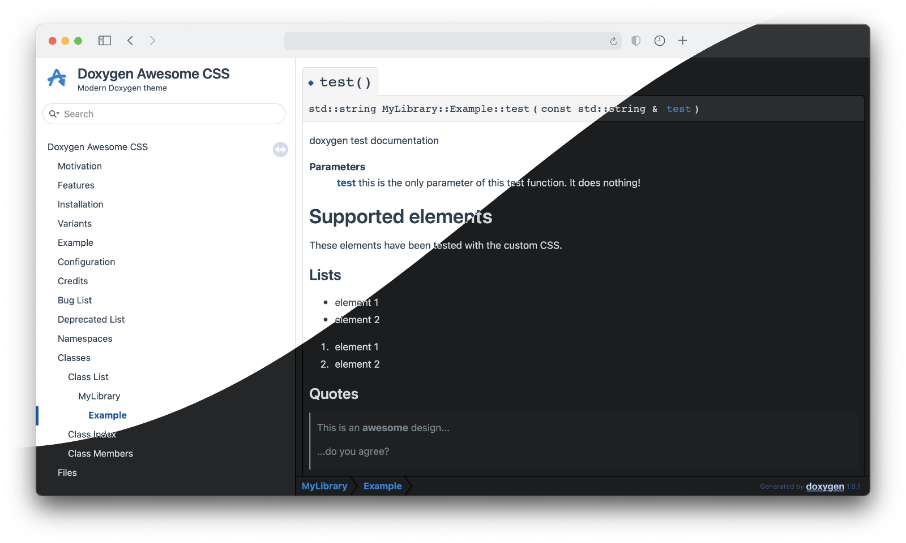
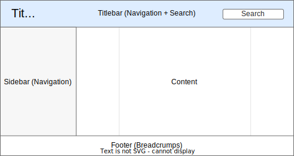
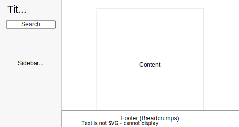

#  Doxygen Awesome

[](https://github.com/jothepro/doxygen-awesome-css/releases/latest)
[](https://github.com/jothepro/doxygen-awesome-css/blob/main/LICENSE)


<div class="title_screenshot">



</div>

**Doxygen Awesome** is a custom CSS theme for Doxygen HTML documentation with lots of customization parameters.

## Motivation

I really like how the Doxygen HTML documentation is structured! But IMHO it looks a bit outdated.

This theme is an attempt to update the visuals of Doxygen without changing its overall layout too much.

## Features

- 🌈 Clean, modern design
- 🚀 Heavily customizable by adjusting CSS variables
- 🧩 No changes to the HTML structure of Doxygen are required
- 📱 Improved mobile usability
- 🌘 Dark mode support!
- 🥇 Works best with **doxygen 1.9.1** - **1.9.4** and **1.9.6** - **1.9.8**

## Examples

Some websites using this theme:

- [Documentation of this repository](https://jothepro.github.io/doxygen-awesome-css/)
- [wxWidgets](https://docs.wxwidgets.org/3.2/)
- [OpenCV 5.x](https://docs.opencv.org/5.x/)
- [Zephyr](https://docs.zephyrproject.org/latest/doxygen/html/index.html)
- [FELTOR](https://mwiesenberger.github.io/feltor/dg/html/modules.html)
- [Spatial Audio Framework (SAF)](https://leomccormack.github.io/Spatial_Audio_Framework/index.html)
- [libCloudSync](https://jothepro.github.io/libCloudSync/)
- [libsl3](https://a4z.github.io/libsl3/)

## Installation

To use the theme when generating your documentation, bring the required CSS and JS files from this repository into your project.

This can be done in several ways:

- manually copying the files
- adding the project as a Git submodule
- adding the project as a npm/xpm dependency
- installing the theme system-wide

All theme files are located in the root of this repository and start with the prefix `doxygen-awesome-`. You may not need all of them. Follow the install instructions to figure out what files are required for your setup.

### Git submodule
For projects that use git, add the repository as a submodule and check out the desired release:

```sh
git submodule add https://github.com/jothepro/doxygen-awesome-css.git
cd doxygen-awesome-css
git checkout v2.3.1
```

### npm/xpm dependency

In the npm ecosystem, this project can be added as a development dependency
to your project:

```sh
cd your-project
npm install https://github.com/jothepro/doxygen-awesome-css#v2.3.1 --save-dev

ls -l node_module/@jothepro/doxygen-awesome-css
```

Similarly, in the [xPack](https://xpack.github.io) ecosystem, this project can be added
as a development dependency to an [`xpm`](https://xpack.github.io/xpm/)
managed project.

### System-wide

You can even install the theme system-wide by running `make install`. 
The files will be installed to `/usr/local/share/` by default, 
but you can customize the install location with `make PREFIX=/my/custom/path install`.

### Choosing a layout

There are two layout options. Choose one of them and configure Doxygen accordingly:

<div class="tabbed">

- <b class="tab-title">Base Theme</b><div class="darkmode_inverted_image">
    
    </div>
    Comes with the typical Doxygen titlebar. Optionally the treeview in the sidebar can be enabled. 

    Required files: `doxygen-awesome.css`

    Required `Doxyfile` configuration:
    ```
    GENERATE_TREEVIEW      = YES # optional. Also works without treeview
    DISABLE_INDEX = NO
    FULL_SIDEBAR = NO
    HTML_EXTRA_STYLESHEET  = doxygen-awesome-css/doxygen-awesome.css
    HTML_COLORSTYLE        = LIGHT # required with Doxygen >= 1.9.5
    ```

- <b class="tab-title">Sidebar-Only Theme</b><div class="darkmode_inverted_image">
    
    </div>
    Hides the top titlebar to give more space to the content. The treeview must be enabled in order for this theme to work.

    Required files: `doxygen-awesome.css`, `doxygen-awesome-sidebar-only.css`

    Required `Doxyfile` configuration:
    ```

    GENERATE_TREEVIEW      = YES # required!
    DISABLE_INDEX          = NO
    FULL_SIDEBAR           = NO
    HTML_EXTRA_STYLESHEET  = doxygen-awesome-css/doxygen-awesome.css \
                            doxygen-awesome-css/doxygen-awesome-sidebar-only.css
    HTML_COLORSTYLE        = LIGHT # required with Doxygen >= 1.9.5
    ```

</div>

<br>

@warning
- This theme is not compatible with the `FULL_SIDEBAR = YES` option provided by Doxygen!
- `HTML_COLORSTYLE` must be set to `LIGHT` since Doxygen 1.9.5!

### Further installation instructions

- [Installing extensions](docs/extensions.md)
- [Customizing the theme (colors, spacing, border-radius, ...)](docs/customization.md)
- [Tips and Tricks for further configuration](docs/tricks.md)

## Browser support

Tested with

- Chrome 119, Chrome 119 for Android, Chrome 119 for iOS
- Safari 17, Safari for iOS 16
- Firefox 118, Firefox 120 for Android, Firefox 119 for iOS
- Edge 119


The theme does not strive to be backward compatible with (significantly) older browser versions.


## Credits

Thanks for all the bug reports and inspiring feedback on GitHub!

Special thanks to all the contributors:
<br><br>
<a href="https://github.com/jothepro/doxygen-awesome-css/graphs/contributors">
    
</a>


<div class="section_buttons">

|                        Read Next |
|---------------------------------:|
| [Extensions](docs/extensions.md) |

</div>
